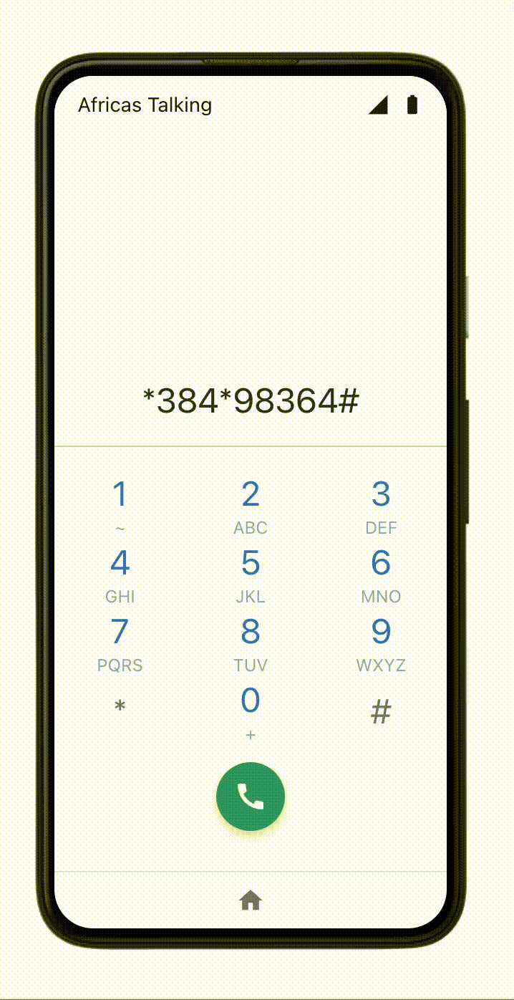

# About Risk Assess USSD

Risk Assess USSD is a USSD application that allows users to assess their insurance risk and get a quote for their insurance policy.
The application is built using the Africa's Talking USSD API.

A customer can dial the USSD code and answer a few questions to get a risk assessment and a quote for their insurance policy.

The application is built using Node.js and Express.js.

## Getting Started

1. Clone the repository
2. Install the dependencies using `npm install`
3. Run the application using `npm start` or `npm run dev` for development
4. The application will be running on `http://localhost:3000`
5. Use a tool like [ngrok](https://ngrok.com/) or [localtunnel](https://localtunnel.github.io/www/) to expose the application to the internet
6. You can now use the exposed URL to configure the USSD application on Africa's Talking
7. The entry point for the USSD application is `http://<exposed-url>/ussd`
